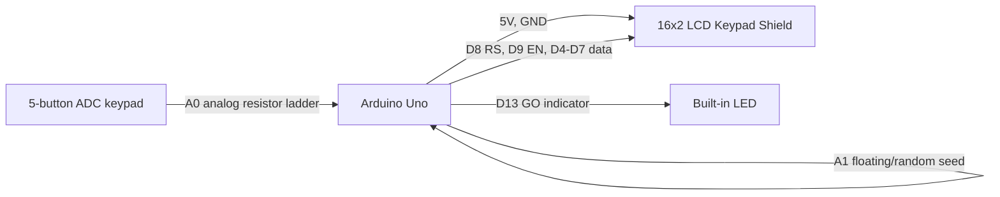

# ReactionTime App

ReactionTime App is an Arduino reaction-time game built for an Arduino Uno and a 16x2 LCD keypad shield. The project tests how quickly a player can respond after a random waiting period by showing a "GO NOW!" prompt on the LCD and turning on the built-in LED. When the player presses a keypad button, the program calculates the elapsed time with `millis()` and displays the reaction time in milliseconds. The game also detects early button presses, shows a warning, and lets the player restart the round with SELECT.

## Schematics

The LCD keypad shield plugs directly into the Arduino Uno headers, so no loose jumper wires are required when using a compatible shield. The table below documents the signal connections used by the sketch and assigns a wire color for schematic drawings or breadboard versions of the same circuit. If this project is redrawn in a circuit tool, use different colors for each signal path and keep the wires separated so the LCD, keypad, LED, power, and ground connections are easy to inspect.

| Color | Connection | Arduino Pin | Purpose |
| --- | --- | --- | --- |
| Red | Shield 5V to Arduino 5V | 5V | Powers the LCD keypad shield |
| Black | Shield GND to Arduino GND | GND | Common ground |
| Blue | LCD RS | D8 | LCD register select |
| Green | LCD Enable | D9 | LCD enable signal |
| Yellow | LCD D4 | D4 | LCD data bit 4 |
| Orange | LCD D5 | D5 | LCD data bit 5 |
| Purple | LCD D6 | D6 | LCD data bit 6 |
| Brown | LCD D7 | D7 | LCD data bit 7 |
| White | Keypad resistor ladder | A0 | Reads RIGHT, UP, DOWN, LEFT, and SELECT buttons |
| Gray | Floating random seed input | A1 | Adds variation to random wait timing |
| Teal | Built-in LED | D13 | Turns on when the GO signal appears |

## Pre-requisites

### Hardware Components

| Component | Model / Type | Quantity | Specification Link |
| --- | --- | --- | --- |
| Microcontroller board | Arduino Uno R3 with ATmega328P | 1 | [Arduino Uno R3 documentation](https://docs.arduino.cc/hardware/uno-rev3/) |
| Display and keypad | DFRobot Gravity 1602 LCD Keypad Shield, SKU DFR0009, or compatible LCD keypad shield | 1 | [DFRobot DFR0009 specification](https://wiki.dfrobot.com/dfr0009) |
| USB cable | USB-A to USB-B cable for Arduino Uno | 1 | [Arduino Uno R3 getting started details](https://docs.arduino.cc/resources/datasheets/A000066-datasheet.pdf) |
| Computer | Windows, macOS, or Linux computer capable of running Arduino IDE | 1 | [Arduino software](https://www.arduino.cc/en/software) |

### Software Components

| Software | Purpose | Link |
| --- | --- | --- |
| Arduino IDE | Opens, compiles, and uploads the sketch | [Arduino IDE download](https://www.arduino.cc/en/software) |
| LiquidCrystal library | Controls HD44780-compatible character LCD displays | [Arduino LiquidCrystal library](https://docs.arduino.cc/libraries/liquidcrystal/) |
| Project sketch | Main source file for this project | [`reactiontime-app.ino`](reactiontime-app.ino) |

## Setup and Build

1. Place the LCD keypad shield on top of the Arduino Uno, making sure all shield pins align with the Arduino headers.
2. Connect the Arduino Uno to the computer with the USB cable.
3. Open Arduino IDE.
4. Open `reactiontime-app.ino`.
5. Select the board from `Tools > Board > Arduino AVR Boards > Arduino Uno`.
6. Select the correct serial port from `Tools > Port`.
7. Confirm the built-in `LiquidCrystal` library is available. It is included with the standard Arduino IDE installation.
8. Verify that the sketch uses this constructor: `LiquidCrystal lcd(8, 9, 4, 5, 6, 7);`.
9. Click Verify to compile the sketch.
10. Click Upload to flash the program to the Arduino.

## Running

1. After upload, the LCD shows `Reaction Game` on the first line and `Press SELECT` on the second line.
2. Press SELECT to begin a round.
3. Wait while the LCD shows `Get ready...` and `Wait for GO!`.
4. Do not press early. If a button is pressed before the GO signal, the game shows `Too early!`.
5. When the LCD shows `GO NOW!` and the built-in LED turns on, press any keypad button as fast as possible.
6. Read the reaction time on the LCD, shown as `Time:<value> ms`.
7. Press SELECT again to return to the start screen and play another round.

## Button Values

The keypad shield buttons are read through `analogRead(A0)`.

| Button | ADC Range Used |
| --- | --- |
| RIGHT | `< 50` |
| UP | `< 200` |
| DOWN | `< 400` |
| LEFT | `< 600` |
| SELECT | `< 850` |
| NONE | `> 1000` |

These thresholds match common Arduino LCD keypad shields. If your shield reads different analog values, adjust the thresholds in `readLCDButtons()`.

## Program Details

The sketch uses a small state machine:

| State | Description |
| --- | --- |
| `WAIT_START` | Waits for SELECT to begin. |
| `RANDOM_WAIT` | Waits through the random delay and checks for early presses. |
| `SHOW_GO` | Records the player's reaction after the GO signal. |
| `SHOW_RESULT` | Displays the measured reaction time. |
| `TOO_EARLY` | Displays the early-press warning. |

The random delay is generated with `random(2000, 5001)`, so each round waits between 2000 ms and 5000 ms. `randomSeed(analogRead(A1))` uses an unconnected analog input to vary the random sequence. The game uses edge detection so holding a button down does not count as repeated presses.

## Files

| File | Description |
| --- | --- |
| `reactiontime-app.ino` | Main Arduino sketch |
| `README.md` | Project documentation |
